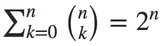
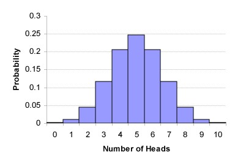
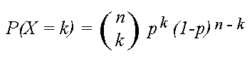

# binomial-coefficient
Review of the importance of the binomial coefficient in combinatorics, polynomial expansions, and probability

Definition
---
"Binomial" is so named as it refers to a two-state entity or process. For example,
- Binomial: Linear combination of two polynomials (e.g. x2-1)
- Binomial Distribution: Discrete probability distribution <i>P</i>(<i>n</i>|<i>N</i>)
of obtaining <i>n</i> successes given <i>N</i> Bernoulli trials (e.g. flipping a coin)

Permutations and Combinations
---
Image a line of people waiting to get into a movie theater. The total number of
<i>permutations</i>, or ways to order the people in the line, is n! =
n•(n-1)•(n-2)•...•2•1.

However, in this situation we really only care about how many people get in before the
theater fills up. If there are only k seats available, and n people waiting in line, how
many possible <i>combinations</i> of people can we get into the theater? Only the first
k people will make it in. The answer is thus to take the total number of permutations n!
divided by the permutations that the first k people can take k! (because we don't care
how they are arranged) divided also by the number of permutations the people who don't
make it in take (n-k)! (because we also don't care how they are arranged):

The vertical stacking of n and k is read "n-choose-k", and is known as the binomial
coefficient.

Binomial Expansion
---
Despite its innocent looks, Pascal's triangle is a powerful tool for visualizing binomial
expansions and distributions. It is also one of the earliest mathematical recurrence
relations learned in school, although this is hardly appreciated:

By defining each element as the sum of its upper-left and upper-right elements,
each row describes the solution to the binomial expansion of (1+x)n:
- (1+x)0 = <b>1</b>
- (1+x)1 = <b>1</b>x + <b>1</b>
- (1+x)2 = <b>1</b>x2 + <b>2</b>x + <b>1</b>
- (1+x)3 = <b>1</b>x3 + <b>3</b>x2 + <b>3</b>x + <b>1</b>
- (1+x)4 = <b>1</b>x4 + <b>4</b>x3 + <b>6</b>x2 + <b>4</b>x + <b>1</b>

These coefficients are in fact the same binomial coefficients used before for calculating
the number of combinations:

where in this case n is the power of n in (1+x)n, and k is the power of the
corresponding term in the polynomial expansion.

Having established the relationship (and equivalence) of Pascal's triangle and the
binomial coefficient formula, Pascal's triangle is therefore the act of counting up all
possible combinations of a subgroup k from the total n. Consequently, the solution to
the binomial expansion is to count up all combinations of power terms k (x0,
x1, ..., xn-1, xn) for a given power of n in
(x+1)n.

Pascal's triangle and the binomial coefficient are unified by the following recurrence
relation:

Binomial Distribution
---
The binomial coefficient describes the number of possible combinations that result from
n choose k, and can therefore be used to construct a full binomial distribution as a
function of k. For example, what is the probability of flipping heads 3 times and tails
7 times, regardless of the order of the events? We need to count up all the possible
combinations of events to get 3 heads and 7 tails (10-choose-3).

Then we have to divide this by the total number of possible combinations for all
possible values of k. Thankfully, this can be computed simply as 210,
leading to another import combinatorics equation:

Plot of the discrete binomial probability distribution for 10 coin flips:

But what if the coin is unfair? This only requires a small tweak, finally leading us to
the binomial distribution formula:

giving the probability of X equal to k, where p is the probability of a successful event.

Poisson Distribution
---
As a final side note, in the limiting case where the probability of a successful event is
small and the number of trials becomes very large, the Binomial distribution simplifies
into the Poisson distribution:

where k is the number of times a successful event occurs within a set interval and lambda
is the average number of events per interval. One useful property of both the Binomial
and Poisson distributions is the expected value is readily calculated as p*n and lambda,
respectively.

References
---
- Python Algorithms: Mastering Basic Algorithms in the Python Language - Magnus Lie Hetland
- Mathematical figures: https://en.wikipedia.org/wiki/Binomial_coefficient
- Binomial distribution figure: http://esa21.kennesaw.edu/modules/basics/exercise3/3-6.htm
